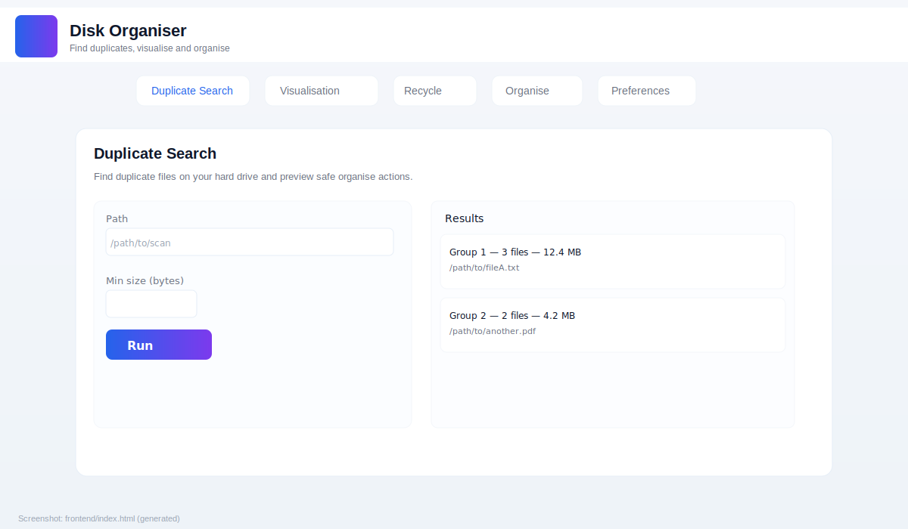

# Disk Organiser

Disk Organiser is a small prototype for visualising and safely organising files on a
local filesystem. It provides:

- A Flask backend API for scanning, finding duplicates, and applying safe
	organise operations (with backups).
- A minimal static frontend for quick visualisation and previewing actions.
- Optional AI-assisted suggestions via pluggable model wrappers.

This repository contains the backend API under `backend/` and the frontend in
`frontend/`.


Website: https://krahd.github.io/disk_organiser/
Demo (static): https://krahd.github.io/disk_organiser/demo/
Download (release): https://github.com/krahd/disk_organiser/releases/tag/v0.1.0


## Quick start (macOS / Linux)

Create a virtual environment, install dependencies and run the API:

```bash
python3 -m venv venv
source venv/bin/activate
pip install -r backend/requirements.txt
python backend/app.py
```

Open `frontend/index.html` in a browser. The frontend expects the API at
`http://127.0.0.1:5000` by default.

## Screenshot




## Features

- Scan directories and detect duplicate files using content hashing.
- Lightweight visualisation of folder structure and sizes.
- Preview organise suggestions and execute operations with automatic backups.
- Optional AI model integration (pluggable providers) to suggest keeps/moves.

## Docker / Compose

Use the included `Dockerfile` and `docker-compose.yml` for a containerised
run:

```bash
docker-compose up --build
```

If you want background jobs with Redis and RQ, start Redis first:

```bash
docker-compose up -d redis
python backend/worker.py
```

## Model integration

Model providers are optional and live under `backend/model_wrappers/`.
The app will try to load a provider from the environment variable
`MODEL_PROVIDER` or from saved config. See `docs/MODEL_INTEGRATION.md` for
details on writing a provider wrapper.

## Development

Run the test-suite (recommended before publishing a release):

```bash
pip install -r backend/requirements.txt
pytest -q backend/tests
```

See `docs/DEVELOPMENT.md` for more development notes and helpful commands.

## API

The backend exposes a simple REST API used by the frontend. See
`docs/API.md` for endpoint descriptions and example payloads.

## Releases

This repository includes a GitHub Actions workflow to create version tags and
publish releases (.github/workflows/release.yml). You can also use the helper
script `scripts/release.sh` to create a local tag and push it to origin.

## Documentation

Additional documentation is available in the `docs/` folder:

- `docs/USAGE.md` — user-facing usage and examples
- `docs/DEVELOPMENT.md` — developer setup and testing
- `docs/API.md` — API reference
- `docs/MODEL_INTEGRATION.md` — how to add model providers

## About

See `ABOUT.md` for a brief project description and goals.

---

## License

This project is licensed under the MIT License — see the [LICENSE](LICENSE) file for details.

## Documentation

A user manual and contributing guidelines are included in the `docs/` folder:

- [docs/USER_MANUAL.md](docs/USER_MANUAL.md) — user manual and usage examples
- [docs/CONTRIBUTING.md](docs/CONTRIBUTING.md) — how to contribute, run tests, and submit PRs

## Disclaimer

This software is provided "AS IS", without warranty of any kind, express or implied. Use at your own risk.

If you'd like a trimmed README (for GitHub About or package metadata), tell me
which sections to keep and I will produce it.
