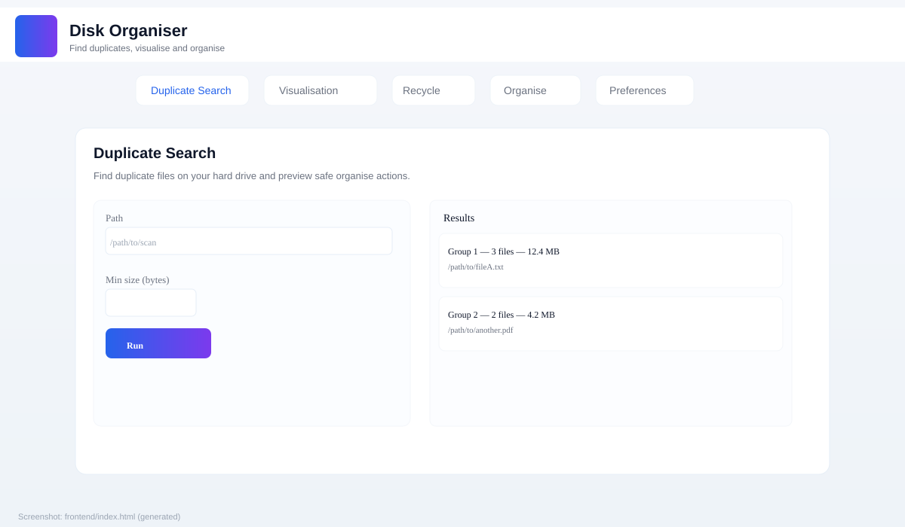

# Disk Organiser

> Safety acceptance is held. Independent review found a persisted-journal trust flaw in the earlier copy-first candidate. Defensive repair validates all saved data, makes the app read-only by default, requires a fresh in-process preview for explicitly opted-in synthetic copy tests, and disables automatic recovery removal. Keep all originals, copies and journals. See [current safety limits](docs/GUIDED-COPIES.md) before synthetic development use.

Disk Organiser is a local-first prototype. Its default guided workflow scans a chosen local folder, explains a file-type overview and compares the current layout with an exact proposed copy layout. This default workflow is read-only: it does not apply copies or offer automatic removal. Copy execution exists only for explicitly enabled synthetic development tests with fresh approval. Originals stay in place; no disk space is reclaimed.

The first version supports top-level regular files on macOS/Linux, up to 500 entries and 1 GiB. It excludes cloud/synced/network folders, links and metadata-preserving copies. [Read the workflow and recovery limits](docs/GUIDED-COPIES.md) before use. Guided mode uses no AI or external services. Legacy analysis/move/delete interfaces remain experimental and are outside the guided guarantees.

This repository contains the backend API under `backend/` and the frontend in
`frontend/`.


Website: https://krahd.github.io/disk_organiser/
Demo (static): https://krahd.github.io/disk_organiser/demo/
Download (latest releases): https://github.com/krahd/disk_organiser/releases


## Run the application

Use the repository launcher:

```bash
./scripts/dev.sh
```

It creates an ignored `.venv` when needed, starts the API and frontend as one same-origin process, and opens `http://127.0.0.1:5000/ui/`. Set `DISK_ORGANISER_OPEN_BROWSER=0` for headless runs.

## Quick start (macOS / Linux)

Create a virtual environment, install dependencies and run the API:

```bash
python3 -m venv venv
source venv/bin/activate
pip install -r backend/requirements.txt
python backend/app.py
```

Open `http://127.0.0.1:5000/ui/` in a browser. The frontend uses relative `/api` paths
by default. For local development run the backend with `python backend/app.py`
(default API: `http://127.0.0.1:5000`). When running in Docker the backend runs
on port `8000` (see `Dockerfile` / `docker-compose.yml`). You can override the
frontend API base at runtime by setting `window._DISK_ORGANISER_API_BASE`.

## Screenshot




## Current default workflow

- Inspect a bounded top-level file-type overview, including skipped entries and limits.
- Compare keeping the current layout with a proposed extension-based copy layout.
- Inspect searchable, paged exact paths without applying changes.
- Revisit local history with explicit stale-session, unsupported-platform and unavailable-recovery states.
- No AI or external services in this guided workflow. The broader read-only Disk Map remains future work.

## Read-only Disk Map export preview

The separate integration preview at `/ui/disk-map.html` opens a Disk Model v1 export or bundled synthetic example. It presents selected-root coverage, logical versus allocated/unknown storage, possible project/archive/inbox roles, file relationships, evidence and non-executable review choices. It does not scan, mutate files or contact a model. Imports stay in tab memory and are not uploaded. [Read the import/privacy limits and current verification](docs/ux/DISK-MAP-IMPORT-CHECKPOINT.md).

This remains a structured observation viewer, not complete project understanding or a coherent reorganisation engine. The producer CLI/library is documented in [Disk Model v1](docs/DISK-MODEL-V1.md). Opening a JSON export never grants access to the paths it contains.

## Retained experimental interfaces

The legacy interface is retained outside default navigation. It includes duplicate detection, directory visualisation, optional model-generated plans and chat refinement, and backup/move/undo infrastructure. These are not the default guided experience or a safety guarantee. Legacy mutation routes are separately disabled by default; release and real-folder acceptance remain held. See [the current boundaries](docs/GUIDED-COPIES.md).

## Docker / Compose

Use the included `Dockerfile` and `docker-compose.yml` for a containerised
run:

```bash
docker-compose up --build
```

If you want background jobs with Redis and RQ, start Redis first:

```bash
docker-compose up -d redis
python backend/worker.py
```

## Model integration

Model providers are optional and live under `backend/model_wrappers/`.
The app will try to load a provider from the environment variable
`MODEL_PROVIDER` or from saved config. See `docs/MODEL_INTEGRATION.md` for
details on writing a provider wrapper.

## Development

Run the test-suite (recommended before publishing a release):

```bash
pip install -r backend/requirements.txt
pytest -q backend/tests
```

See `docs/DEVELOPMENT.md` for more development notes and helpful commands.

## API

The backend exposes a simple REST API used by the frontend. See
`docs/API.md` for endpoint descriptions and example payloads, and `docs/openapi.json`
for the machine-readable route spec validated in CI.

## Releases

This repository includes a GitHub Actions workflow to create version tags and
publish releases (.github/workflows/release.yml). You can also use the helper
script `scripts/release.sh` to create a local tag and push it to origin.

## Documentation

Additional documentation is available in the `docs/` folder:

- `docs/USAGE.md` — user-facing usage and examples
- `docs/DEVELOPMENT.md` — developer setup and testing
- `docs/API.md` — API reference
- `docs/MODEL_INTEGRATION.md` — how to add model providers
- `docs/NEXT_STEPS.md` — prioritized follow-up implementation checklist

## About

See `ABOUT.md` for a brief project description and goals.

---

## License

This project is licensed under the MIT License — see the [LICENSE](LICENSE) file for details.

## Disclaimer

This software is provided "AS IS", without warranty of any kind, express or implied. Use at your own risk.


