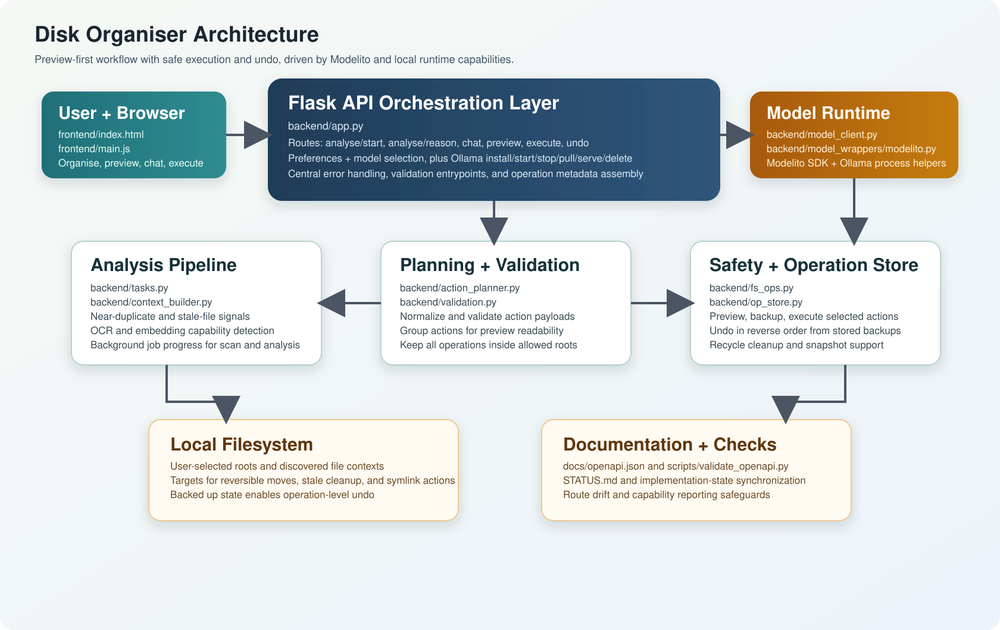
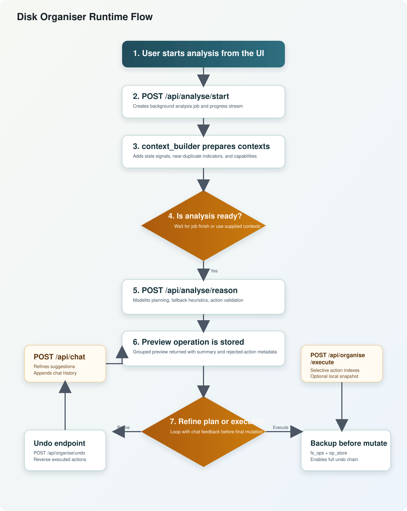

# Disk Organiser – Project Status

Last updated: 2026-05-06 19:13

## Executive Summary

The repository is now in a phase where semantic analysis, typed reversible actions,
and conversational refinement are implemented end-to-end.

Model provider selection is now normalized onto Modelito, with Ollama lifecycle
management exposed through dedicated API routes and the preferences GUI.

The major architecture shift has already happened:

- from duplicate-only suggestions,
- to context-driven analysis with grouped preview, selective execution, and undo.

A comprehensive test pass was executed on this date and is green.

## Visual Overview

### Architecture Diagram



### Flow Chart



## Implemented Capabilities

### Analysis Pipeline

Implemented:

- background context build via POST /api/analyse/start
- reasoning phase via POST /api/analyse/reason
- conversational refinement via POST /api/chat
- grouped operation preview via GET /api/ops/<op_id>/preview
- Modelito-backed provider default with Ollama control endpoints:
  GET /api/ollama/status and POST /api/ollama/install|start|stop|pull|serve|delete

Context includes:

- path/name/extension/mime/size/mtime
- stale-file heuristics
- near-duplicate signals and scores

### Near-Duplicate Detection (Content-Aware)

Current strategies in backend/context_builder.py:

- normalized filename/token similarity
- sampled content term overlap for text-like files
- PDF body extraction (pypdf with fallback parser)
- DOCX body extraction (OOXML parsing)
- image perceptual hashing (Pillow + ImageHash)
- size similarity

Exposed fields:

- near_duplicate_key
- near_duplicate_group_size
- near_duplicate_signals
- near_duplicate_score

### Safe Operation Lifecycle

Implemented and active:

- typed actions (move, delete_stale, create_symlink, reorganise_folder)
- operation preview before execute
- backup before mutate
- undo in reverse action order
- action validation constrained to scan roots

### Frontend Workflow

Organise tab now supports:

- running analysis
- grouped diff-like action preview
- per-action selection and selective execution
- chat-based refinement
- signal visibility for why items were clustered
- runtime capability banner showing whether optional OCR and embedding enhancements are available
- explicit OCR and embedding capability status rows (available/unavailable + missing dependency names)

Visualisation tab supports:

- include_insights mode
- folder-level semantic/stale summary panels

### Safety and Governance

Implemented:

- macOS backup status endpoint (GET /api/safety/backup-status)
- optional local snapshot trigger during execution
- analysis preview payload now includes runtime optional capability flags (`analysis_capabilities`)
- OpenAPI route drift check (scripts/validate_openapi.py)
- CI route coverage validation against docs/openapi.json

## Comprehensive Test Results (2026-05-06)

Executed successfully:

- source venv/bin/activate && pytest -q backend/tests
  - Result: 27 passed
- source venv/bin/activate && python scripts/validate_openapi.py
  - Result: OpenAPI validation passed for 31 routes
- npm test --silent
  - Result: 1 suite passed, 2 tests passed
- npm run format:check
  - Result: all matched files use Prettier code style
- npm run test:visual (with npm run start server running)
  - Result: 2 Playwright tests passed
- source venv/bin/activate && pytest -q backend/tests/test_context_builder.py
  - Result: 9 passed (includes monkeypatch coverage for missing optional dependencies and disabled embedding model)
- npm test --silent -- frontend/__tests__/organise.analysis.test.js
  - Result: 1 suite passed, 4 tests passed (includes unavailable and available capability-banner states)
- source venv/bin/activate && pytest -q backend/tests/test_analysis_api.py
  - Result: capability payload branches for disabled/enabled dependency scenarios validated
- npm test --silent -- frontend/__tests__/organise.analysis.test.js
  - Result: expanded coverage for selection payloads, refine rerender behaviour, and explicit capability indicators

## Optional Runtime Dependencies

All optional features degrade gracefully — missing packages are caught at import time and the
affected capability silently disables. No configuration is required to run the tool without them.

### OCR Dependencies

- `pytesseract`: OCR text extraction from images and scanned PDFs.
  System requirement: Tesseract OCR binary (`brew install tesseract` / `apt install tesseract-ocr`).
- `pdf2image`: PDF-to-image conversion for scanned PDF OCR.
  System requirement: Poppler (`brew install poppler` / `apt install poppler-utils`).

Install both to enable the OCR path:

```bash
pip install pytesseract pdf2image
```

OCR is attempted as a fallback only: for PDFs it runs when `pypdf` yields fewer than 8 tokens;
for image files it runs after perceptual hashing when `pytesseract` is available.

Content kind tags when OCR is active: `pdf-ocr`, `image-phash-ocr`, `image-ocr`.

### Embedding Similarity Dependencies

- `sentence-transformers`: semantic embedding vectors for hard near-duplicate detection.
- `numpy`: L2 normalisation and cosine similarity.

Install both to enable the embedding path:

```bash
pip install sentence-transformers numpy
```

Embedding similarity is tried as a last-resort signal when no other near-duplicate signal is found.
Pairs with cosine similarity ≥ 0.90 __and__ size similarity ≥ 0.40 are clustered with the
`"embedding-similarity"` signal.

### Environment Toggles

- `DISK_ORGANISER_EMBEDDING_MODEL` (default: `all-MiniLM-L6-v2`): name of the
  `sentence-transformers` model to load. Set to any compatible HuggingFace model identifier.
  The model is downloaded on first use and cached locally by the library.

To disable embeddings without uninstalling the package, set the variable to an empty string or an
invalid model name — the load failure is caught and embeddings are disabled for the session.

## Current Risks / Gaps

1. Embedding and OCR enhancements are optional and only active when extra dependencies are installed.
2. OCR quality for scanned and low-quality documents still requires real-world tuning and broader validation.
3. Windows-specific runtime behavior is not validated by dedicated CI.
4. Frontend test depth is still limited (modal + visual smoke vs broad unit coverage).
5. Live Modelito planning quality still depends on the configured Ollama model and local runtime availability.

## Recommended Next Steps

1. Add a Windows CI lane to validate path and filesystem behavior.
2. Expand frontend unit tests for Organise analysis flow to include edge cases around failed network calls and SSE interruptions.
3. Add integration coverage for capability indicator rendering on large analysis payloads.

## Repository Documentation Alignment

This report reflects the current state and supersedes earlier planning assumptions
that marked semantic analysis, near-duplicate detection, and conversational flow
as unimplemented.
